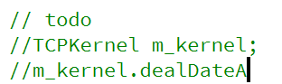

# 网盘文件
这里是自写网盘的客户端  
******
## 开发笔记
*2024/7/28*  
头文件**不能互相包含**  
对于客户端来说，kernel只是个中间值，因此不许要单例模式，
而客户端那边，kernel既要处理网络模块，又要处理数据库模块，
因此需要主动保证只有一份将其设为单例模式。  
在客户端这边主要是靠ui界面客户的操作，来处理数据。  
``dealdata``中来区分传来的包是什么包，目前有两种方案  
1. 通过switch判断
2. 通过协议映射表  

但是``switch``有一个弊端，就是我每增加包的一个种类就需要增加一个分支。  
所以我选择了协议映射表，通过协议映射表，``dealdata``内的代码就不需要在进行变动，
我只需要在表中增加数据就可以了。  
>所谓协议映射表，就是类似一个静态结构体（包）数组，通过遍历包的标识符（开头的第一个字节），来判断包是什么类型。  
>并在该数据结尾添加{0,0}来终止循环

``#include<XX.h>``回导入头文件的全部内容，并不会导入子下cpp文件，因此可以用此方法避免循环导入  
*2024/7/29*  
数据处理模块需要保证和网络模块为同一个kernel，因此可以把他设置为单例模式，或者传参传过去。  
kernel只在ui下new一份。其他地方不会再new。如果kernel不一致，qt信号和槽将会不一样。极度容易把发送信号的对象
弄错  
  
因为采用了网络模块采用了多线程线程，所以qt的第五个参数要更改为阻塞连接  

